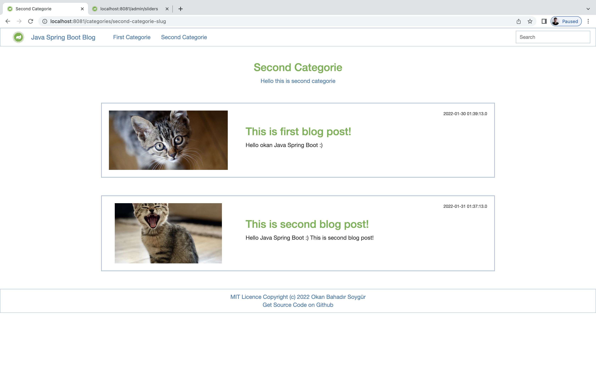
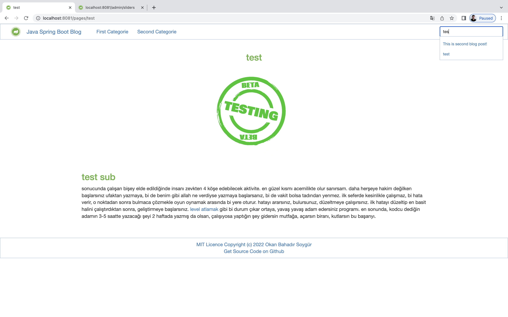
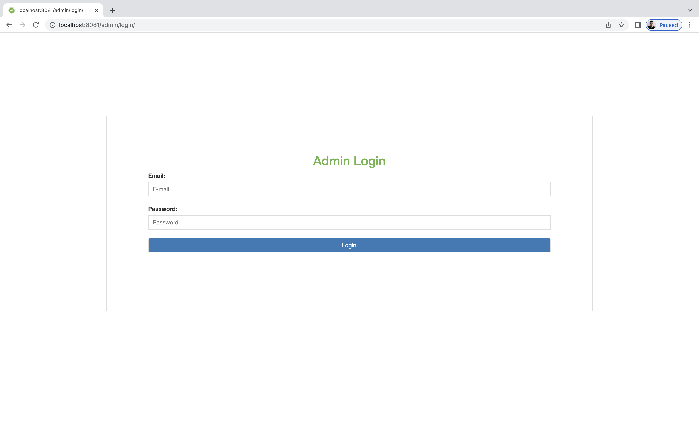
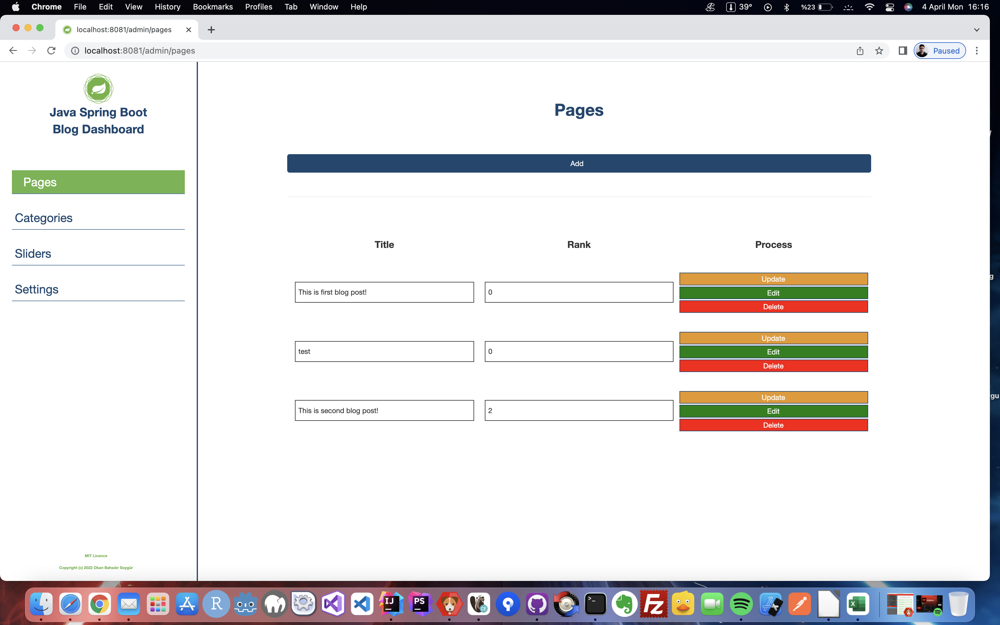
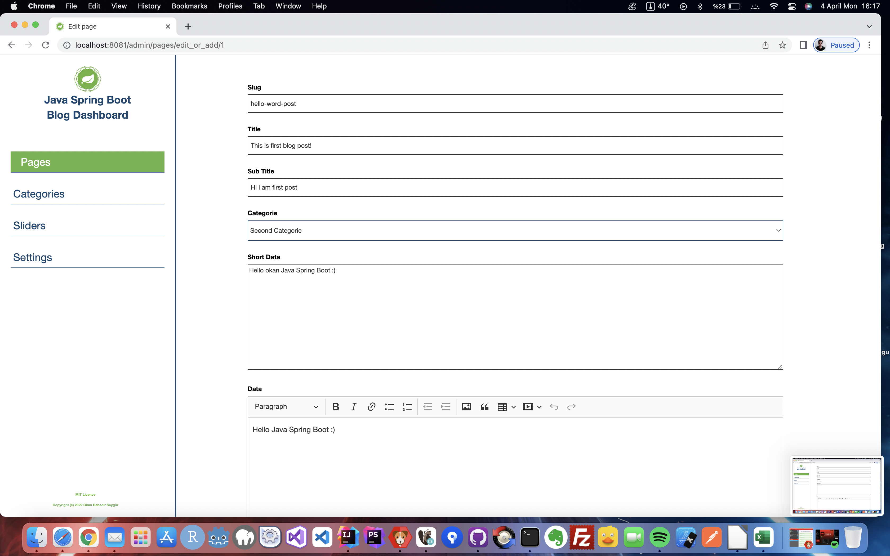
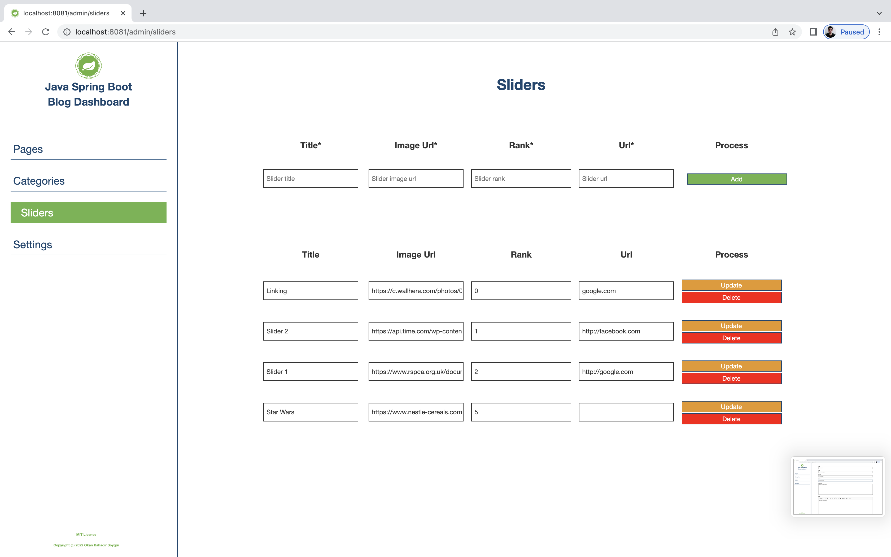
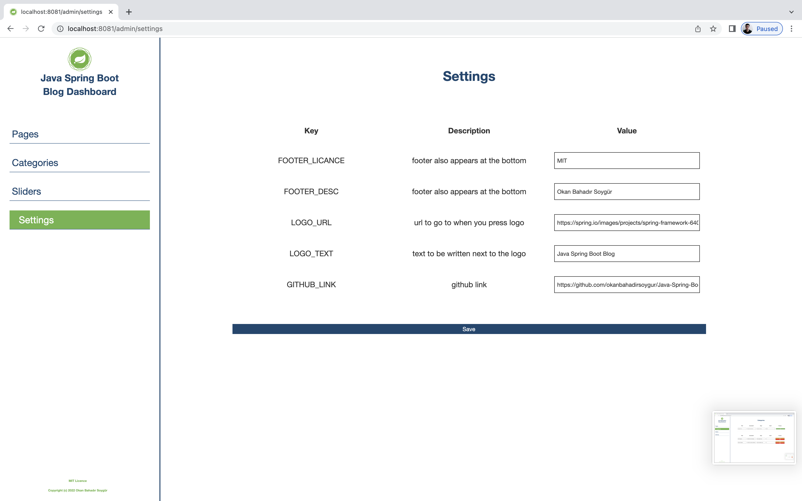

# Java Spring Boot and MariaDB Blog Example
#### version 1.0.0

### Screenshots 

### Screenshots Admin Panel

### Admin Panel Login
##### Username:test@test.com
##### Password:test

### Used Technologies;

#### Back-End
- Java
- Spring Boot 
- Hibernate, JPA (Java Persistence API)
- MariaDB

#### Front End
- Thymeleaf (Template Engine)
- Pure Javascript
- Bootstrap
- Swiper Slide
- Scss

### Java Language Level 17
### JDK Oracle OpenJDK 17
### SpringBoot version 2.6.2
### MariaDB version 10.6.4

### @Developed by okan bahadır soygür (okanbahadirsoygur@gmail.com)

